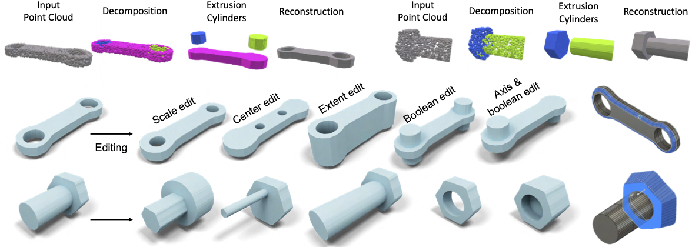

# Point2Cyl: Reverse Engineering 3D Objects from Point Clouds to Extrusion Cylinders 
**[Point2Cyl: Reverse Engineering 3D Objects from Point Clouds to Extrusion Cylinders](https://arxiv.org/abs/2112.09329)** 

Mikaela Angelina Uy<sup>\*</sup>, Yen-Yu Chang<sup>\*</sup>, Minhyuk Sung, Purvi Goel, Joseph Lambourne, Tolga Birdal and Leonidas Guibas

CVPR 2022



## Introduction
We propose **Point2Cyl**, a supervised network transforming a raw 3D **point** cloud **to** a set of extrusion **cylinders**. Reverse engineering from a raw geometry to a CAD model is an essential task to enable manipulation of the 3D data in shape editing software and thus expand their usages in many downstream applications. Particularly, the form of CAD models having a sequence of extrusion cylinders — a 2D sketch plus an extrusion axis and range — and their boolean combinations is not only widely used in the CAD community/software but also has great expressivity of shapes, compared to having limited types of primitives (e.g., planes, spheres, and cylinders). In this work, we introduce a neural network that solves the extrusion cylinder decomposition problem in a geometry-grounded way by first learning un- derlying geometric proxies. Precisely, our approach first predicts per-point segmentation, base/barrel labels and nor- mals, then estimates for the underlying extrusion param- eters in differentiable and closed-form formulations. Our experiments show that our approach demonstrates the best performance on two recent CAD datasets, Fusion Gallery and DeepCAD, and we further showcase our approach on reverse engineering and editing.

```
@inproceedings{uy-point2cyl-cvpr22,
      title = {Point2Cyl: Reverse Engineering 3D Objects from Point Clouds to Extrusion Cylinders},
      author = {Mikaela Angelina Uy and Yen-yu Chang and Minhyuk Sung and Purvi Goel and Joseph Lambourne and Tolga Birdal and Leonidas Guibas},
      booktitle = {Conference on Computer Vision and Pattern Recognition (CVPR)},
      year = {2022}
  }
```

## Pre-requisites
Code was tested using Python 3.8 with CUDA 11.0
```
python3.8 -m venv env
source env/bin/activate
pip install -r requirements.txt
```

## Data download
Dataset downloads can be found in the [link](http://download.cs.stanford.edu/orion/Point2Cyl/data.tar.gz), and it should be extracted in the project home folder.

## Training
* To train Point2Cyl without sketches, example commands are as follows:
```
python train_Point2Cyl_without_sketch.py --logdir=log/Point2Cyl_without_sketch/ --pred_seg --pred_normal --pred_bb --data_dir=data/
```

* To train Point2Cyl with sketches, example commands are as follows:
```
python train_Point2Cyl.py --logdir=log/Point2Cyl --pred_seg --pred_normal --pred_bb --pc_logdir=log/Point2Cyl_without_sketch/ --is_pc_init --is_pc_train --im_logdir=results/IGR_dense/ --is_im_init --is_im_train --data_dir=data/
```

## Evaluation
Example commands to run evaluation script are as follows:
```
# For Point2Cyl without sketches.
python eval.py --logdir=results/Point2Cyl_without_sketch/ --dump_dir=dump/Point2Cyl_without_sketch/ --data_dir=data/

# For Point2Cyl with sketches.
python eval.py --logdir=results/Point2Cyl/ --dump_dir=dump/Point2Cyl/ --data_dir=data/
```

## Pre-trained Models
The pretrained models for our Point2Cyl can be found in [results](results/).

## Visualization
Example commands to run visualization script are as follows:
```
python visualizer.py --logdir=results/Point2Cyl --model_id=55838_a1513314_0000_1 --dump_dir=dump_55838_a1513314_0000_1 --output_dir=output_55838_a1513314_0000_1 --data_dir=data/
```

